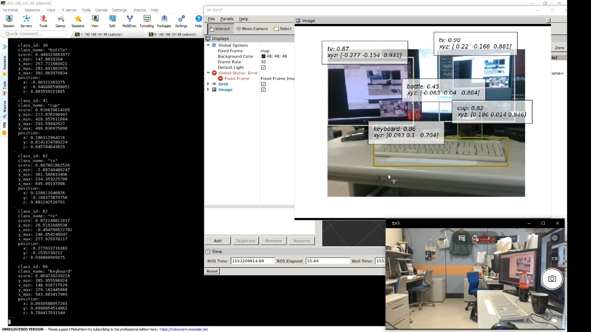

object_detector_3d ROSパッケージ
===

[TOC]

# 概要

RGDBカメラにより計測する画像と点群を用いて、環境中の複数の物体を検出し、各物体の種類と3次元座標を取得することができるROSパッケージを作成した。

## 動作環境

以下の環境で動作確認している。

- Ubuntu 16.04.6
- ROS kinetic
- Python 2.7.16
- Intel RealSense D435

# 使用方法

` object_detector_3d` ディレクトリが、インストール可能なROSパッケージとなっている。後述の方法によりインストールした後、 D435を接続した状態で次のコマンドを実行することで検出器が作動する:

```bash
$ roslaunch object_detector_3d run.launch
```

そうすると、物体の3次元検出結果が `/object_detection_3d ` という名前のトピックから ` object_detector_3d/msg` に定義されている `Detection3DResult` 型の メッセージとして発行される。 `Detection3DResult` 型は複数個の `Detection3D` 型メッセージをまとめたものであり、個別の検出は `Detection3D` 型により表現されている。

また、検出結果を視覚的に確認できるように、 `/object_detection_3d/result_image` トピックから `sensor_msgs.Image` 型のメッセージを発行することができる。

実行中の様子は次の図のようになる。

- 図の左側には `rostopic echo /object_detection_3d` による出力が表示されている。
- 図の右上には `rviz` 経由で  `/object_detection_3d/result_image`  が表示されている。

右上を見るとこの場面には視点の手前側からキーボード、マグカップ、ボトル、2台のモニターがあり、それぞれが検出されていることがわかる。各検出ごとにキャプションがついており、次の情報が表示されている:

- 物体の名前。
- 検出のスコア。区間 `[0, 1] ` に含まれる数値であって、1に近いほど確信度が高い。
- 物体の中心点（後述）の3次元座標。座標系は原点がカメラの中心であり、x, y, z軸の方向はそれぞれ右、下、奥向きで、単位はメートルである。

5つの検出結果について、特に奥行方向の距離であるzの値に注目すると、物体の位置が手前から奥に遠のくのにつれて値が大きくなっていることが確認できる。

## インストール

あらかじめROSの環境構築は済んでいるとする。またPythonは2.7であり、numpyやmatplotlibなどの主要なパッケージはインストール済みであるとする。

そのうえで、以下のコマンドにより依存ライブラリをインストールする。

```bash
$ pip install pyrealsense2 chainer chainercv
$ cd ~/catkin_ws/src
$ git clone https://github.com/eric-wieser/ros_numpy.git
```

さらに、 `object_detector_3d` ディレクトリを `~/catkin_ws/src` に配置し、

```bash
$ cd ~/catkin_ws/
$ catkin_make
```

によってインストールする。

なお、Pythonの正確な環境情報は `py2_object_detector_3d.yml` に記載されている。Anacondaを利用している場合は、

```bash
$ conda env create -f py2_object_detector_3d.yml
```

により環境をインポートしたうえで、

```bash
$ conda activate py2_object_detector_3d
```

により環境を再現することができる。

# ROSノード

`/object_detector_3d` の依存・出版トピックは以下のとおりである:

```bash
[sakurai@ ~]$ rosnode info /object_detector_3d
--------------------------------------------------------------------------------
Node [/object_detector_3d]
Publications:
 * /object_detection_3d [object_detector_3d/Detection3DResult]
 * /object_detection_3d/result_image [sensor_msgs/Image]
 * /rosout [rosgraph_msgs/Log]

Subscriptions:
 * /camera/color/image_raw [sensor_msgs/Image]
 * /camera/depth/color/points [sensor_msgs/PointCloud2]

Services:
 * /object_detector_3d/get_loggers
 * /object_detector_3d/set_logger_level
...
```

さらに依存トピックがこれらに加えて、

```
sensor_msgs.CameraInfo
realsense2_camera.Extrinsics
```

も必要となる。

## 購読トピック

各購読トピックの意味は次のとおりである:

- `/camera/color/image_raw`: カラー画像。2D物体検出に使う。
- `/camera/depth/color/points` 3D点群。3次元位置を求めるために使う。そのため、上記の `/camera/color/image_raw` と時間的に同期が取れている必要がある。
- `sensor_msgs.CameraInfo`: `/camera/color/image_raw` のカメラの内部パラメタ。
- `realsense2_camera.Extrinsics`: 点群の座標系からカラーカメラ座標系へと変換するための外部パラメタ。なお、これはRealSenseの独自型であるが、アルゴリズム上必要となるのは回転・並進パラメタのみである。

## 出版トピック

各出版トピックの意味は次のとおりである:

- `/object_detection_3d`: 1対の画像と点群から得られる検出結果を格納する独自型であり、

  ```
  int32 num_detections
  Detection3D[] detections
  ```

  となっている。 `detections` は複数の `Detection3D` を含む。 `Detection3D` は1つの検出を格納する独自型であり、

  ```
  int32 class_id
  string class_name
  float32 score
  float32 y_min
  float32 x_min
  float32 y_max
  float32 x_max
  geometry_msgs/Point position
  ```

  となっている。 `class_id` 、 `class_name` はそれぞれ整数のクラス番号と文字列のクラス名であり、 `score` は確信度である。`y_min, x_min, y_max, x_max` は2D検出における画像座標系におけるbounding box (bbox) の左上と右下の頂点の座標である。最後に

   `position`  が3次元位置である。

  

- `/object_detection_3d/result_image`: 検出に用いた画像に`Detection3D` の情報を書き込んだものになっており、前記の図の右上のような画像である。

# 実装の詳細

## 入出力データ

本ソフトウェアはカメラと点群により計測したシーン中に存在する複数の物体を検出することができる。

具体的には、入力として以下のデータを用いる:

- 2Dカメラ画像
- 3D点群
- カメラの内部パラメタ
- 点群座標系におけるカメラの配置を表す外部パラメタ

出力として、各物体について以下の情報が得られる:

- 点群座標系における物体の中心点の座標
- 物体の種類
- 検出の確信度

## アルゴリズムの概要

以下の手順で物体の3D座標を求める:

1. カメラから取得した画像を入力として、物体検出器を用いて画像中の複数個の物体を検出する。
2. 各検出に対応するbbox (bounding box) について、点群座標系における視錐台（frustum）を求める。
3. 各検出に対応する視錐台について、その中に含まれる点群の部分集合を抽出する。
4. 各部分点群について、中心点の座標を算出する。
5. 2D検出と3D中心点座標を統合して、3D検出結果とする。

## 各アルゴリズムの説明

### (1) 2D物体検出

2D物体検出器とは、画像に含まれる（事前に定義された種類の）物体を検出するものをいう。検出とは、2D画像を入力すると、複数個の物体のそれぞれについて以下の情報を予測として出力することである:

- 物体を囲む矩形（axis aligned bounding box, bbox）
- 物体の種類
- 予測の確信度

具体的に用いる物体検出器は、 [SSD300](https://arxiv.org/abs/1512.02325) を [MS COCO](http://cocodataset.org/) データセットにより訓練したものであり、ConvNetによる80クラス物体検出器である。具体的な全てのクラスは[リンク先のリストを参照](https://github.com/chainer/chainercv/blob/64ee516fb8c6f750d6940de81900a62aaee9fff8/chainercv/datasets/coco/coco_utils.py#L89-L168)されたい。

実装はpythonの深層学習フレームワークの [chainer](https://github.com/chainer/chainer) に依存しており, 特に画像用途向けの拡張パッケージである [chainercv](https://github.com/chainer/chainercv) を用いている。

### (2, 3)部分点群の抽出

ここでは前ステップで得たbbox情報に依存している。個別のbboxについて、点群の全ての点のうち、カメラ視点からみてbboxの内側に入る点のみを部分点群として抽出している。

### (4) 部分点群の中心点の算出

部分点群は、対象物体とそれ以外の背景や遮蔽物に由来する点からなる。これらの点群を代表する1点に集約した点を、ここでは中心点と呼ぶ。

中心点の定義には様々なものが考えられるが、本ソフトウェアでは部分点群の重心を中心点として定義した。

ただし、この手法は物体と非物体を区別せずにデータとして用いているため、物体の形状やbboxのズレなどによっては物体そのものの重心から離れた座標が算出されてしまう可能性がある。そのため、例えば、非物体を除去したうえで残った点群の重心をとる、などのより良い中心点の定義が考えられる。

### (5) 2D検出と3D中心点座標の統合

単純なため省略する。

# ソフトウェアの保守・拡張について

## 独自の2D物体検出器を利用する場合

同梱されている2D物体検出器は標準的な物体の種類に対応しているが、タスクに特化した検出器を別途作成した場合などに、それに取り替えることができる。特に、フレームワークに依存していないため、Chainer以外を利用することもできる。

そのためには、インタフェースクラスとして `object_detectors.BaseObjectDetector` で自前の検出器をラップし、 `predict` メソッドと `class_name_from_number` プロパティを実装したクラスを作成したうえで、`main_object_detector_3d.py#L167`の

```python
    detector_2d = COCOSSD300Detector()
```

を自前のクラスと置き換えればよい。

## RealSense以外のセンサーを利用する場合

本実装では、時間同期のとれた画像と点群を取得する必要があるためRealSenseを用いている。また、外部パラメタのデータ形式として `realsense2_camera` パッケージの独自型を用いている。そのため、RealSense以外のセンサーを利用する場合には、`main_object_detector_3d.py#L86-87`の

```python
    R = np.array(extrinsics.rotation).reshape(3, 3)
    t = np.array(extrinsics.translation)
```

を修正する必要がある。回転・並進パラメタが取得できたあとの箇所については修正の必要はない。

